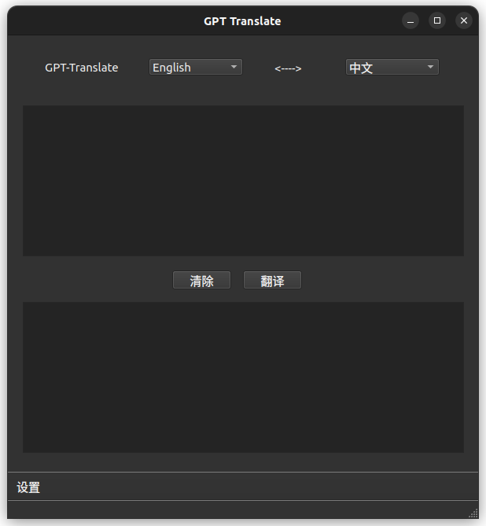
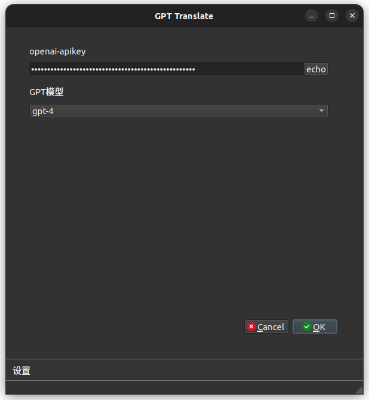

# GPT-Translate
## 功能
+ 支持英汉互译
+ 支持选择不同的模型进行翻译
+ 支持设置代理pyuic6 translate.ui -o Ui_translate.py
## 安装
clone本仓库
```
git clone https://github.com/scavenger-caesar/GPT-Translate.git
```
要使用此工具，您需要在系统上安装 Python 3 以及以下软件包：
+ openai
+ PyQt6
+ pyperclip
您可以通过运行以下命令来安装这些软件包：
```
cd GPT-Translate
pip install -r requirements.txt
```
把界面转换成py文件
```
pyuic6 translate.ui -o Ui_translate.py
```
运行
```
python3 main.py
```
就会有如下画面出现

进入设置后设置自己的api key确认后就能正常使用了
